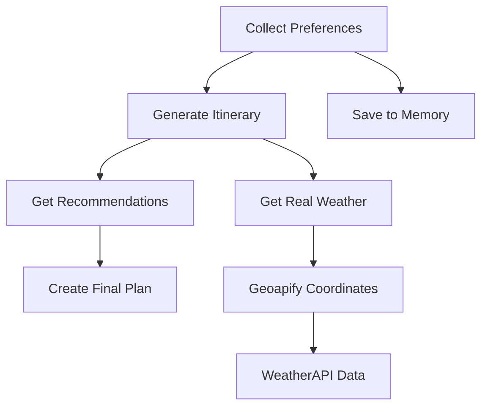

# 🌍 Simple Travel Planner with LangGraph

A beginner-friendly agentic AI travel planner built with **LangGraph** and **Groq's Llama** model, featuring real-time weather integration and memory capabilities.

## ✨ Features

- **Real-time Weather**: Live weather data using WeatherAPI + Geoapify
- **Smart Routing**: Conditional edges based on completion status  
- **Memory System**: Saves user preferences for personalized experience
- **Tool Integration**: External API calls for enhanced recommendations
- **Beginner-Friendly**: Clear examples of all LangGraph concepts

## 📚 LangGraph Concepts Demonstrated

| Concept | ✅ Status | Implementation |
|---------|-----------|----------------|
| **State** | ✅ | `TravelState` TypedDict manages data flow |
| **Nodes** | ✅ | 4 processing functions for different tasks |
| **Edges** | ✅ | Conditional routing based on state content |
| **Tools** | ✅ | Real APIs for weather and coordinates |
| **Memory** | ✅ | Simple storage for user preferences |

## 🚀 Quick Start

### Prerequisites
```bash
pip install langgraph langchain-groq requests
```

### API Keys Required
- **Groq API Key**: Get from [Groq Console](https://console.groq.com)
- **WeatherAPI Key**: Get from [WeatherAPI](https://www.weatherapi.com/) 
- **Geoapify Key**: Get from [GeoApify](https://www.geoapify.com/geocoding-api/)

### Setup
```bash
# Set your Groq API key
export GROQ_API_KEY="your-groq-api-key-here"

# Run the planner
python main.py
```

## 🔧 How It Works



### Workflow Steps

1. **📝 Collect Preferences**: Gathers destination, budget, duration, interests
2. **🌤️ Get Real Weather**: Uses Geoapify → WeatherAPI for live conditions  
3. **📅 Generate Itinerary**: Creates day-by-day plan with weather considerations
4. **🏨 Get Recommendations**: Suggests hotels, restaurants, transportation
5. **📋 Final Plan**: Combines everything into polished travel guide

## 🛠️ Tools in Action

### Real Weather Tool
```python
@tool
def get_real_weather(destination: str) -> str:
    # Step 1: Get coordinates using Geoapify
    # Step 2: Get weather using WeatherAPI
    # Returns: "Paris: 18°C, Partly cloudy, Feels like 16°C"
```

### Memory Tool
```python
@tool
def save_preferences(user_data: dict) -> str:
    # Saves user preferences for future trips
    # Returns: "Preferences saved for user_12345"
```

## 📖 Example Usage

```
🌍 Welcome to Simple Travel Planner!
Where would you like to travel? Paris
What's your budget range? medium
How many days? 3
What are your interests? museums, food, architecture

📅 Generating itinerary...
✅ Itinerary generated (Real Weather: Paris: 18°C, Partly cloudy, Feels like 16°C)

🏨 Getting recommendations...
✅ Recommendations generated

📋 Creating final travel plan...
✅ Final plan created

🎉 YOUR TRAVEL PLAN IS READY!
```

## 🔍 Key Learning Points

### For LangGraph Beginners:
- **State Management**: How data flows between nodes
- **Conditional Logic**: Smart routing based on completion
- **Tool Integration**: Extending AI capabilities with external APIs
- **Memory Patterns**: Storing and retrieving user data
- **Error Handling**: Graceful API failure management

### Real vs Mock Data:
- **Mock**: "Weather varies by season, check local forecast"
- **Real**: "London: 12°C, Light rain, Feels like 9°C"

## 📁 Project Structure

```
travel_planner.py
├── State Definition (TravelState)
├── API Integration (WeatherAPI + Geoapify)
├── Tools (get_real_weather, save_preferences)
├── Nodes (4 processing functions)
├── Graph Creation (StateGraph setup)
└── Main Execution (CLI interface)
```

## 🚀 Next Steps

Ready to extend this? Try adding:
- **Database persistence** instead of in-memory storage
- **Multiple destination support** for multi-city trips
- **Budget tracking** with real cost APIs
- **Image generation** for destination previews
- **Email/PDF export** of travel plans

## 🤝 Contributing

This is a learning project! Feel free to:
- Add more sophisticated tools
- Improve error handling
- Add tests
- Create a web interface
- Enhance the memory system

## 📄 License

MIT License - Build, learn, and share!

---

**Perfect for**: LangGraph beginners wanting to understand agentic AI with real-world integrations

**Built with**: LangGraph v0.6+ | Groq Llama | WeatherAPI | Geoapify